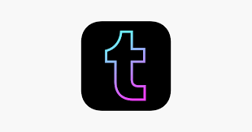

# Tumblr Android Native Application

  
  
  

## Project Description

It is an Android Native version of <a href="https://www.tumblr.com/explore/trending?source=homepage_explore"Tumblr 
</a> application where Kotlin is the programming language used.
This project aims to mimic most of Tumblr's features.
The architecture used is MMVM.

## Project Demo 

## Project Contributors

